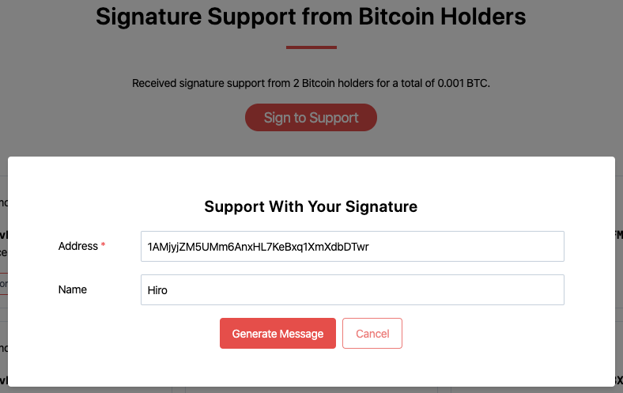
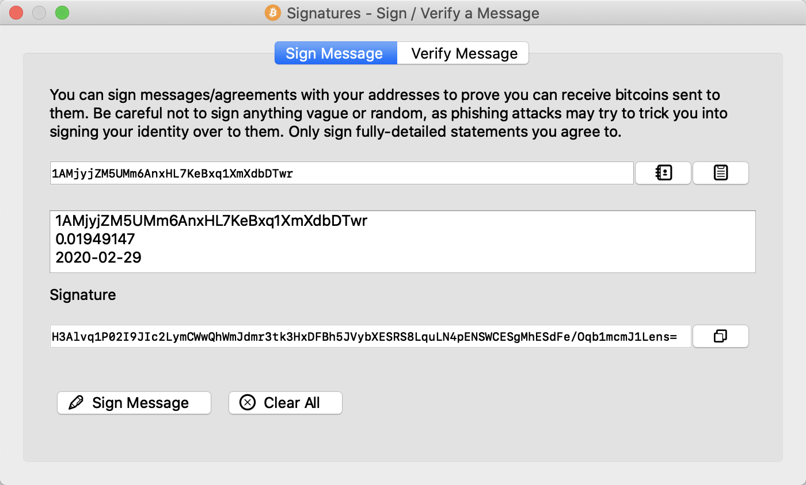
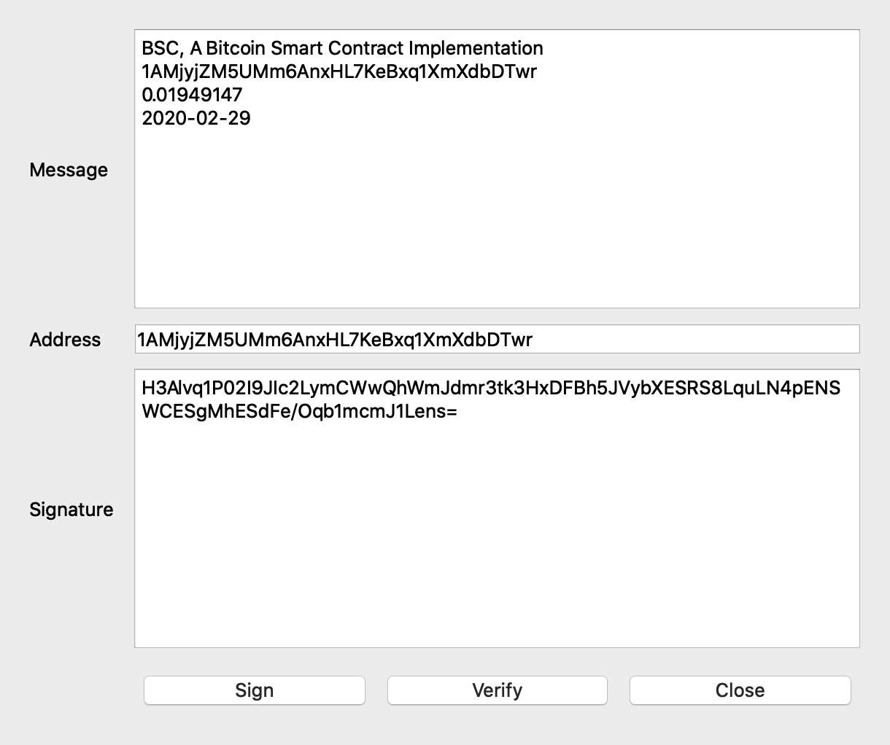
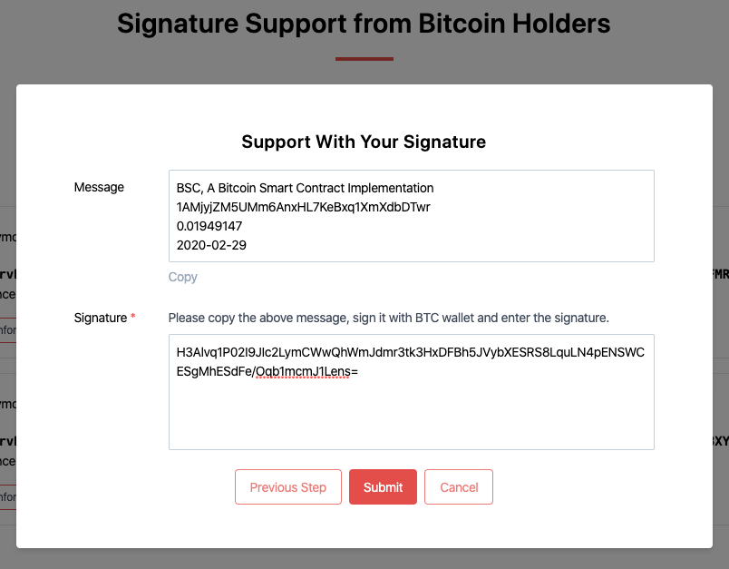

# Sign to Support BSC

If you are a Bitcoin holder, you can use the address that holds Bitcoin to generate a signature for supporting this project. The following provides the signing methods for two commonly used Bitcoin wallets, Bitcoin Core and Electrum. If your Bitcoin is in an exchange, you will need to transfer it to a personal wallet to generate the signature. Due to limitations of Bitcoin wallets, only signatures of "legacy" addresses (beginning with "1") are currently supported. If you encounter any difficulties during the signing process, you can contact us through the community.

# Obtain a Message
Open [https://bsc.net/](https://bsc.net/) and click the `Sign to Support` button. In the opened window, fill in an address that holds Bitcoin and an optional nickname. Click the `Generate Message` button and copy the generated message.

# Sign the Message
## Bitcoin Core
Click on `File -> Sign message`. In the opened window, fill in the address and message, click `Sign Message`, and copy the generated signature.

## Electrum
Click on `Tools -> Sign/verify message`. In the opened window, fill in the address and message, click `Sign`, and copy the generated signature.

# Submit the Signature
Paste the signature into the web form and click `Submit`.

